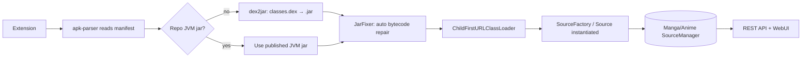
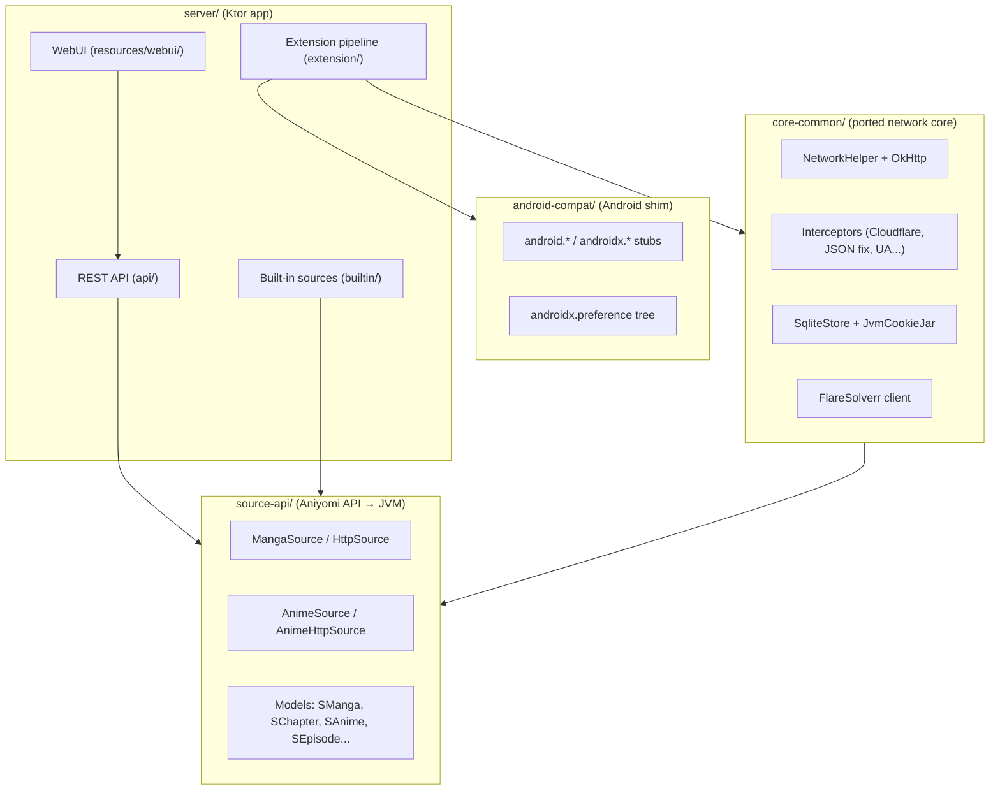

# miwayomi

> **mi·wa·yo·mi** — *"beautiful reading"* · a self-contained server that runs
> **Aniyomi/Tachiyomi-format catalog extensions** on the JVM, with **no Android device, no emulator, no cloud**.

miwayomi is an **execution engine**, not a content service. It loads third-party
extensions in the Tachiyomi/Aniyomi format and exposes their sources through a
clean REST API and a web UI. **It does not distribute, host, index, or endorse
any content, source, or repository.** Extensions are third-party software and
answer for themselves; miwayomi simply runs them and serves their catalog.

---

## Download

| Platform | File | How to run |
| -------- | ---- | ---------- |
| Windows | [miwayomi-setup.exe](https://github.com/miwayomi/miwayomi/releases/latest/download/miwayomi-setup.exe) | Run the installer (Start Menu / desktop shortcut). |
| Any OS | [miwayomi-all.jar](https://github.com/miwayomi/miwayomi/releases/latest/download/miwayomi-all.jar) | `java -jar miwayomi-all.jar` (needs JDK 21). |

All releases: <https://github.com/miwayomi/miwayomi/releases>

The app **auto-updates**: on launch it checks GitHub for a newer release and the
WebUI shows a banner when one is available — it downloads it and applies it on
restart.

---

## Table of contents

1. [The story behind the name](#the-story-behind-the-name)
2. [What miwayomi is (and is not)](#what-miwayomi-is-and-is-not)
3. [Design philosophy](#design-philosophy)
4. [How it works](#how-it-works)
5. [Architecture overview](#architecture-overview)
6. [Anatomy of the codebase](#anatomy-of-the-codebase)
7. [REST API](#rest-api)
8. [The web UI](#the-web-ui)
9. [Building and running](#building-and-running)
10. [Creating your own extension](#creating-your-own-extension)
11. [Streaming internals](#streaming-internals)
12. [Cloudflare challenges](#cloudflare-challenges)
13. [Local persistence](#local-persistence)
14. [Troubleshooting](#troubleshooting)
15. [Roadmap and contributing](#roadmap-and-contributing)
16. [Legal notice](#legal-notice)
17. [Glossary](#glossary)

---

## The story behind the name

Every project deserves a story, and miwayomi got a good one by accident.

It started the way most self-hosted projects start: with a problem and a grudge.
The original plan was modest — **a self-hosted anime player**. I wanted my own
little corner of the internet where I could watch anime through a personal,
controllable server, and I initially tried to build it on top of
[Suwayomi]. That journey was... educational. The project kept **hanging and
crashing** on me, eating RAM like it was going out of style, and fighting me at
every turn. After too many nights of fighting a server that froze mid-episode,
I made the call that so many builders eventually make: **"fine, I'll build my
own."**

So I walked away from Suwayomi and started over from a different angle. Instead
of bolting a player onto an existing stack, I built a lean execution engine
from the ground up, modeled on the ideas of **Aniyomi** (itself born from
**Tachiyomi**) — the same extension format, the same familiar source API, but
reimagined as a **pure JVM service** that needs no Android at all.

The name came later, and honestly, it came from a manga. I was reading a series
and a character named **Miwa** caught my eye — it just *sounded* right. I
latched onto it and turned it into **miwayomi** without having the faintest idea
what it meant. Pure vibe. No research, no dictionary, no regrets. When I
finally looked it up, it turned out to mean roughly **"beautiful reading"** — a
portmanteau of *mi* ("beautiful") and *yomi* ("reading"). A happy accident, and
honestly the best kind: the name picked me before I picked it.

And that's the whole vibe of this project: **beautiful reading, served from a
box on your own desk.** No emulator, no Android device, no "one more
dependency to babysit." Just a server, an API, and the pages you love — on your
terms.

[Suwayomi]: https://github.com/Suwayomi

---

## What miwayomi is (and is not)

| miwayomi **is**                                                    | miwayomi **is not**                                    |
| ------------------------------------------------------------------- | ------------------------------------------------------ |
| An execution engine for Tachiyomi/Aniyomi-format extensions         | A content host or "piracy box"                         |
| A JVM server (Ktor) that runs extensions without Android            | An emulator or a phone-in-the-cloud                    |
| A REST API + web UI over your installed sources                     | A fork, rebrand, or replacement of any client          |
| A teaching tool: learn to write your own compatible sources         | A distributor of extensions or copyrighted media       |

The core rule, repeated throughout this document:

> **Extensions are third-party software.** miwayomi runs them and exposes their
> catalogs. Whatever a source does, it does on its own behalf. You are
> responsible for the extensions you install and the content you access.

---

## Design philosophy

miwayomi was built around a handful of principles that shaped every file:

1. **No Android required.** The whole `android-compat` module exists to make
   extensions believe there is an Android runtime. In reality there is none —
   just a carefully crafted shim on a plain JVM.
2. **Lightweight by default.** The server runs in a single `java` process with a
   small heap and a serial GC. Measured footprint: **~160–170 MB RSS at rest** —
   comfortable on a 4 GB VPS.
3. **Generic, not special-cased.** The extension pipeline is format-driven:
   if an APK declares a source, miwayomi can load it — regardless of who wrote
   it or what it indexes.
4. **Chunked, memory-neutral streaming.** Large media is streamed in 64 KB
   chunks; nothing is ever buffered whole into RAM.
5. **Persistence that survives restarts.** Cookies, resolved Cloudflare hosts,
   favorites, reading progress, installed extensions, and your repository URLs
   live in SQLite.
6. **Respect for the sites.** The proxy forwards the exact headers each source
   needs. If a site is behind Cloudflare, an optional FlareSolverr sidecar
   resolves the challenge automatically.

---

## How it works

Tachiyomi/Aniyomi extensions are **APK files** that announce their catalog
classes in the manifest under `meta-data` (`tachiyomi.extension.class` /
`tachiyomi.animeextension.class`). miwayomi turns those APKs into runnable
sources on the JVM:



1. **Manifest** — `apk-parser` reads `AndroidManifest.xml` and extracts the
   declared catalog class(es).
2. **Bytecode** — if the repository publishes a desktop **JVM jar** next to the
   APK, miwayomi downloads and uses it directly (no DEX conversion). Otherwise
   `dex2jar` converts `classes.dex` into a `.jar`.
3. **Auto repair** — `JarFixer` fixes any jar on first load (tracked by a marker
   entry): it corrects the invalid `invokespecial <init>` owner that DEX→JVM
   conversion introduces on `new T; dup; ...` constructions (which would
   otherwise throw `VerifyError` and return HTTP 500 on search) and preserves
   all valid bytecode untouched.
4. **Class loading** — a *child-first* `ClassLoader` loads the classes so the
   extension can use its own bundled copies of libraries.
5. **Instantiation** — the class is either a `SourceFactory`
   (`createSources(): List<MangaSource>`) or a direct `Source` subclass.
   miwayomi instantiates and registers every produced source.
6. **Exposure** — the manga/anime managers back every catalog endpoint.

Because the mechanism is generic, it works for **any** extension in that
format — the format is the contract, not the vendor.

---

## Architecture overview



| Module | Role |
| ------ | ---- |
| `android-compat/` | Minimal Android shim: the `android.*`/`androidx.*` classes extensions reference, plus the `android.jar` stub used at build time. |
| `core-common/` | The network heart: OkHttp wiring, interceptors, cookie jar, SQLite store, FlareSolverr client, JS engine. |
| `source-api/` | The Aniyomi source API compiled for the JVM: source interfaces and models that extensions implement. |
| `server/` | The Ktor application: extension pipeline, source managers, REST API, streaming proxy, WebUI. |
| `data/` | Runtime data: `data/extensions/*.apk` (+ converted or repo-published `.jar`), source preferences, SQLite cache. |

---

## Anatomy of the codebase

A file-by-file tour of the important pieces. This is the map you want when
you're about to change something.

### `server/` — the application

```
server/src/main/kotlin/miwayomi/
├── Main.kt                 Entry point: parses args, wires DI, starts Ktor.
├── Config.kt               ServerConfig + CLI parsing (--port, --data, --flaresolverr, ...).
├── di/
│   ├── AppModule.kt        Injekt module: registers managers, NetworkHelper, ExtensionManager...
│   └── ConfigHolder.kt     Holds the parsed config for DI (set before Injekt loads).
├── source/
│   └── SourceManagers.kt   MangaSourceManager + AnimeSourceManager: thread-safe
│                           registries (ConcurrentHashMap) for every loaded source.
├── extension/
│   ├── ExtensionManager.kt Loads/unloads APKs (or repo JVM jars), instantiates
│   │                       factories/sources, tracks package ownership, uninstall;
│   │                       auto-fixes every jar on first load.
│   ├── ExtensionMeta.kt    Parsed metadata of a loaded extension.
│   ├── PackageTools.kt     apk-parser (manifest XML), dex2jar, class-name resolution.
│   ├── JarFixer.kt         ASM bytecode repair (invalid <init> owners from DEX→JVM),
│   │                       auto-applied on first load via a marker entry.
│   └── ChildFirstURLClassLoader.kt  ClassLoader that prefers the extension's own
│                                   bundled classes over the parent's.
├── builtin/
│   ├── DemoSource.kt       An offline demo manga source (returns empty catalogs,
│   │                       no network) — a compact reference for the API shape.
│   └── MockCfSource.kt     A test source that simulates a Cloudflare challenge.
└── api/
    ├── ApiRoutes.kt        Thin root: plugins (JSON, status pages), static WebUI,
    │                       /health, /sources, and registers all sub-routers.
    ├── MangaRoutes.kt      Manga endpoints (popular/latest/search/details/chapters/pages).
    ├── AnimeRoutes.kt      Anime endpoints (popular/latest/search/details/episodes/seasons/
    │                       hosters/videos/hosterVideos).
    ├── StreamingRoutes.kt  /proxy, /hls, /dash, /dashseg — chunked media proxy.
    ├── StreamProxy.kt      Rewrites HLS and DASH manifests, resolves segments.
    ├── ProxyHelpers.kt     Header parsing, per-source OkHttp clients, URL normalization.
    ├── MimeTypes.kt        Infers correct MIME from extension when the CDN lies.
    ├── ExtensionRoutes.kt  Repository index (JSON + protobuf), install (prefers
    │                       repo JVM jars)/uninstall.
    ├── SourcePrefsRoutes.kt  GET/POST source preferences.
    ├── FavoritesRoutes.kt  Favorites + last-read progress.
    ├── ApiHelpers.kt       Shared helpers (source lookup, required params, 404s).
    ├── Dtos.kt             All @Serializable response models.
    ├── Mappers.kt          Converters from source models to DTOs.
    └── KeiIndexProto.kt    Protobuf (index.pb, gzip) repository-index parser.
```

### `core-common/` — the network heart

```
core-common/src/main/kotlin/eu/kanade/tachiyomi/network/
├── NetworkHelper.kt        Builds the shared OkHttpClient; owns the SQLite store.
├── JvmCookieJar.kt         Persistent cookie jar backed by SQLite (survives restarts).
├── SqliteStore.kt          SQLite access: kv_store, cookies, favorites, watch history, and extensions tables.
├── CookieCodec.kt          Cookie ↔ stored-row (de)serialization.
├── CfResolvedUa.kt         Persists "host → browser UA" for resolved Cloudflare hosts.
├── CloudflareChallengeException.kt  Signal thrown when a challenge is detected.
├── FlareSolverr.kt         Optional auto-solver client (FlareSolverr /v1).
├── JavaScriptEngine.kt     GraalJS-backed JS engine (QuickJs/Duktape stand-ins).
├── Requests.kt             GET/POST helpers used by sources.
├── OkHttpExtensions.kt     Response/call helpers (await, cache-less calls...).
├── ProgressListener.kt, ProgressResponseBody.kt   Download progress plumbing.
├── HttpException.kt        Typed HTTP errors.
├── Favorite.kt             Favorites/tracking model.
├── NetworkPreferences.kt   Preference wiring for the network stack.
└── interceptor/
    ├── CloudflareInterceptor.kt      Detects 403/429/503 challenges, tries FlareSolverr,
    │                                 or throws CloudflareChallengeException (→ configure FlareSolverr).
    ├── FixDoubleEncodedJsonInterceptor.kt  Repairs double-encoded JSON request bodies.
    ├── UserAgentInterceptor.kt       Injects the configured User-Agent.
    ├── RateLimitInterceptor.kt, SpecificHostRateLimitInterceptor.kt  Polite throttling.
    └── UncaughtExceptionInterceptor.kt  Converts stray failures into typed errors.
```

> **Default client:** the shared `NetworkHelper` client registers the Cloudflare,
> user-agent, JSON-fix, and uncaught-error interceptors only. Gzip and brotli are
> intentionally **not** registered — newer sources check for a plain default
> client — and OkHttp 5.4.0 (with `okhttp-zstd`) exposes
> `okhttp3.CompressionInterceptor` for sources that opt in.

Also in `core-common`: `logcat/` (logging), `tachiyomi/core/common/preference/`
(in-memory preference store), `tachiyomi/core/common/util/` (coroutines, image,
sort helpers), and `aniyomi/core/common/torrent/` (the torrent server is
**disabled** — a stub kept for API compatibility).

### `source-api/` — the extension contract

```
source-api/src/main/kotlin/eu/kanade/tachiyomi/
├── source/
│   ├── MangaSource.kt       The manga source contract.
│   ├── CatalogueSource.kt   Catalog contract (popular/latest/search).
│   ├── ConfigurableSource.kt  Preference screen support.
│   ├── SourceFactory.kt     createSources(): List<MangaSource> — how multi-source APKs work.
│   ├── UnmeteredSource.kt   Opt-in for data-usage exemptions.
│   ├── online/
│   │   ├── HttpSource.kt        The concrete base for HTTP manga sources.
│   │   ├── ParsedHttpSource.kt  Template with Jsoup parsing hooks.
│   │   └── ResolvableSource.kt  Image resolution hook.
│   ├── model/               SManga, SChapter, Page, Filter, FilterList, MangasPage.
│   └── PreferenceScreen.kt  typealias → androidx.preference.PreferenceScreen.
├── animesource/
│   ├── AnimeSource.kt       The anime source contract.
│   ├── AnimeSourceFactory.kt  createAnimeSources().
│   ├── ConfigurableAnimeSource.kt
│   ├── online/AnimeHttpSource.kt, ParsedAnimeHttpSource.kt
│   ├── model/               SAnime, SEpisode, Video, Hoster, FetchType, SAnimeImpl...
│   └── PreferenceScreen.kt  typealias → androidx.preference.PreferenceScreen.
└── util/                    JsoupExtensions, JsonExtensions, RxExtension, VideoInfo.
```

> **Why `typealias` matters:** extensions import
> `androidx.preference.PreferenceScreen`. If miwayomi's own
> `eu.kanade.tachiyomi.source.PreferenceScreen` were a distinct class, the
> overrides would never match and extension preferences would break. Aliasing it
> to the `androidx` type keeps the ecosystem's expectations intact.

> **`memo` field:** `SManga` and `SChapter` include the `memo: JsonObject` field
> that newer extensions populate via `setMemo(...)`; without it those sources
> fail with `NoSuchMethodError`.

### `android-compat/` — the Android shim

```
android-compat/src/main/kotlin/
├── android/app/Application.kt        Application : ContextWrapper : Context
├── android/content/                  Context, ContextWrapper, ContextThemeWrapper, Intent,
│                                     SharedPreferences (+ CompatSharedPreferences),
│                                     PackageManager, Resources...
├── android/os/                       Build, Bundle, Handler, Looper, Message, SystemClock
├── android/webkit/                   WebView, WebViewClient, WebChromeClient, WebSettings,
│                                     CookieManager, ValueCallback
├── android/view/ & android/widget/   View, ViewGroup, AbsoluteLayout
├── android/graphics/                 Bitmap, BitmapFactory, Rect, Drawable
├── android/util/ & android/net/      Log, Base64, Html, DisplayMetrics, AttributeSet, Uri
├── androidx/preference/Preference.kt Real preference tree (group, dialog, edit-text...)
├── app/cash/quickjs/QuickJs.kt       GraalJS-backed stand-in for QuickJs
├── com/squareup/duktape/Duktape.kt   GraalJS-backed stand-in for Duktape
└── (build-time) android.jar stub     Regenerated by scripts/regenerate-android-jar.py
```

The shim has to be careful: classes that miwayomi implements **for real** are
removed from the build-time `android.jar` (see the `OVERRIDDEN` list in
`scripts/regenerate-android-jar.py`), so the JVM loads the working
implementation instead of an empty stub that would throw `Stub!`.

### `server/src/main/resources/webui/` — the interface

```
webui/
├── index.html   Single page: sidebar, toolbar, reader, player, modals.
├── app.js       The whole client: API calls, rendering, i18n (t()), players (hls.js/dash.js).
├── style.css    Dark, responsive theme.
└── lang/
    ├── en.json  English strings (default).
    ├── es.json  Spanish strings.
    └── README.md How to add a language (copy en.json → <code>.json, translate, register).
```

---

## REST API

Base URL: `http://<host>:4567/api/v1` — JSON in, JSON out.

### Endpoints

| Method | Path | Purpose |
| ------ | ---- | ------- |
| `GET` | `/health` | Liveness + source counts. |
| `GET` | `/sources` | All installed manga & anime sources (with owning package). |
| `GET` | `/update` | Current version, latest GitHub release, update status. |
| `GET` | `/manga/{sourceId}/popular?page=` | Popular manga catalog. |
| `GET` | `/manga/{sourceId}/latest?page=` | Latest manga updates. |
| `GET` | `/manga/{sourceId}/search?query=&page=` | Search manga. |
| `GET` | `/manga/{sourceId}/details?url=` | Manga details (url-encoded source URL). |
| `GET` | `/manga/{sourceId}/chapters?url=` | Chapter list. |
| `GET` | `/manga/{sourceId}/pages?url=` | Page image URLs. |
| `GET` | `/anime/{sourceId}/popular?page=` | Popular anime catalog. |
| `GET` | `/anime/{sourceId}/latest?page=` | Latest anime updates. |
| `GET` | `/anime/{sourceId}/search?query=&page=` | Search anime. |
| `GET` | `/anime/{sourceId}/details?url=` | Anime details. |
| `GET` | `/anime/{sourceId}/episodes?url=` | Episode list. |
| `GET` | `/anime/{sourceId}/seasons?url=` | Seasons. |
| `GET` | `/anime/{sourceId}/hosters?url=` | Hosters. |
| `GET` | `/anime/{sourceId}/videos?url=` | Extracted video streams. |
| `GET` | `/anime/{sourceId}/hosterVideos?url=&hoster=` | Videos from a specific hoster. |
| `GET` | `/proxy?url=&headers=` | Generic media/image proxy (supports Range). |
| `GET` | `/hls?url=&headers=` | HLS manifest proxy (rewrites segment URIs). |
| `GET` | `/dash?url=` | DASH manifest proxy (rewrites SegmentTemplate/SegmentList). |
| `GET` | `/dashseg?base=&rel=` | DASH segment fetcher (resolves base + relative path). |
| `GET` | `/sources/{sourceId}/prefs` | Read a source's declared preferences. |
| `POST` | `/sources/{sourceId}/prefs` | Save preferences (`{key: value}`). |
| `GET` | `/favorites` | List favorites. |
| `GET` | `/favorites/check?sourceId=&url=` | Is this entry favorited? |
| `POST` | `/favorites` | Add favorite (`{sourceId,url,title,thumbnailUrl,type}`). |
| `DELETE` | `/favorites?sourceId=&url=` | Remove favorite. |
| `POST` | `/favorites/progress` | Save last-read chapter progress. |
| `GET` | `/watch` | Anime watch history ("Continue watching"). |
| `POST` | `/watch` | Save/update anime watch progress (`{sourceId,animeUrl,epUrl,...}`). |
| `DELETE` | `/watch?sourceId=&animeUrl=&epUrl=` | Remove a watch-history entry. |
| `GET` | `/extensions/repo?url=` | List an extension repository's index. |
| `GET` | `/extensions/installed` | List locally installed extensions (restored from the database). |
| `GET` | `/extensions/repos` | Load the user's saved repository URLs. |
| `POST` | `/extensions/repos` | Save the user's repository URLs `{repos:[...]}` (persisted). |
| `POST` | `/extensions/install` | Install `{repoUrl, apk}` (registered in the database). |
| `POST` | `/extensions/uninstall` | Uninstall `{pkg}`. |

### Examples

```bash
# Health
curl http://localhost:4567/api/v1/health
# {"status":"ok","service":"miwayomi","mangaSources":7,"animeSources":13}

# All sources
curl http://localhost:4567/api/v1/sources

# Popular manga from source <id>, page 1
curl "http://localhost:4567/api/v1/manga/7374498796507972405/popular?page=1"

# Search within a source
curl "http://localhost:4567/api/v1/manga/7374498796507972405/search?query=one+piece&page=1"

# Details for a catalog entry (url is the source's own URL, percent-encoded)
curl "http://localhost:4567/api/v1/manga/7374498796507972405/details?url=%2Fmanga%2F123"

# Chapters for that manga
curl "http://localhost:4567/api/v1/manga/7374498796507972405/chapters?url=%2Fmanga%2F123"

# Page image URLs for a chapter
curl "http://localhost:4567/api/v1/manga/7374498796507972405/pages?url=%2Fchapter%2F456"

# Read a source's preferences
curl "http://localhost:4567/api/v1/sources/7374498796507972405/prefs"

# Save a preference
curl -X POST http://localhost:4567/api/v1/sources/7374498796507972405/prefs \
     -H 'Content-Type: application/json' -d '{"quality":"1080p"}'

# List an extension repository index
curl "http://localhost:4567/api/v1/extensions/repo?url=https://example.com/repo/index.json"

# List locally installed extensions (restored from the database)
curl "http://localhost:4567/api/v1/extensions/installed"

# Load / save the user's repository URLs (persisted in the database)
curl "http://localhost:4567/api/v1/extensions/repos"
curl -X POST http://localhost:4567/api/v1/extensions/repos \
     -H 'Content-Type: application/json' \
     -d '{"repos":["https://example.com/repo/index.json"]}'

# Install an extension
curl -X POST http://localhost:4567/api/v1/extensions/install \
     -H 'Content-Type: application/json' \
     -d '{"repoUrl":"https://example.com/repo","apk":"com.example.mylib.apk"}'

# Uninstall it
curl -X POST http://localhost:4567/api/v1/extensions/uninstall \
     -H 'Content-Type: application/json' -d '{"pkg":"com.example.mylib"}'
```

> Source IDs are 64-bit values and are returned as **strings** in the API.
> Keep them as strings in your client — JavaScript numbers lose precision above
> 2^53 and lookups would 404.

---

## The web UI

Open `http://localhost:4567` in a browser. The UI is a single vanilla-JS page
with:

- **Sidebar** — sources grouped by extension package (so a 60-mirror package
  shows as one entry, not sixty), plus a Favorites view.
- **Catalog** — Popular / Latest / Search per source.
- **Reader** — image pages for manga chapters.
- **Player** — plays every format: HLS (hls.js), DASH (dash.js), and direct
  MP4/WebM, all routed through the streaming proxy.
- **Extension manager** — browse a repository index, install/uninstall, see
  per-extension status (all from the "＋ Extensions" button). Installed
  extensions and your repository URLs are saved in the database and restored
  on every start.
- **Source settings** — a "⚙ Config" button per source renders its declared
  preferences (switches, dropdowns, text fields) and saves them.
- **Favorites** — star titles and jump back to the last chapter you read.
- **Continue watching** — a home row built from the SQLite watch history that
  resumes each anime episode exactly where you left off.
- **Player extras** — invert the episode order (newest/oldest), auto-play the
  next episode when one finishes, auto-select the best video source, and a ↺
  restart button per episode.
- **AniList sync** — connect your own AniList account in Settings to push your
  watched-episode progress automatically.
- **i18n** — English and Spanish out of the box; add a file in `lang/` for more.

---

## Building and running

### Requirements

- **JDK 21** (Temurin recommended). Gradle downloads itself via the wrapper.
- **FlareSolverr** (optional) to solve Cloudflare challenges automatically.

### Docker (recommended for servers / VPS)

```bash
docker compose up -d      # builds miwayomi + FlareSolverr (from source, in a venv)
```

- WebUI/API: `http://localhost:4567` · FlareSolverr: `http://localhost:8191`
- Persistent data (SQLite, extensions, cookies) lives in the named volume
  `miwayomi-data`.
- The `Dockerfile` builds the fat JAR with a JDK stage and runs it with a slim
  **JRE** (no JDK, no browser). FlareSolverr is built from source inside a
  Python **virtualenv** (`docker/flaresolverr.Dockerfile`) and bundles its own
  headless Chromium engine — required by FlareSolverr, not part of miwayomi.
- Tune JVM memory with the `JAVA_OPTS` env var; change the solver URL with
  `FLARESOLVERR_URL` (empty disables it).

### Quick start (desktop / JAR)

`java -jar miwayomi-all.jar` (from the
[Releases](https://github.com/miwayomi/miwayomi/releases) page) just works: it
picks a **free port**, starts, and opens your default browser with the real URL.
The launcher `./miwayomi` (macOS/Linux) / `miwayomi.bat` (Windows) does the same
and opens a **dedicated app window** (Chrome/Edge `--app`), stopping the server
when you close the window.

```bash
java -jar miwayomi-all.jar      # any OS — auto port + opens the browser
./miwayomi                      # desktop launcher (app window)
```

Force a port with `--port 4567`; `--no-open` disables opening a browser.

### Auto-update

On startup the server checks GitHub for a newer release: if one exists it
downloads the new JAR and the WebUI shows a banner ("New version available —
close and relaunch to apply"). The next launch applies it (previous JAR kept as
`miwayomi-all.jar.bak`). Status: `GET /api/v1/update`.

### Windows installer

`packaging/build-installer.sh` (needs NSIS: `sudo apt install nsis` /
`brew install nsis` / `yay -S nsis`) produces
`packaging/dist/miwayomi-setup-<version>.exe`. Pass
`JRE_ZIP=temurin-21-windows-x64.zip` to bundle a JRE for a standalone installer.
A GitHub Actions workflow also builds it automatically on each release
(`.github/workflows/build-installer.yml`).

### Lightweight build (recommended for a VPS)

```bash
cd /home/asking/Escritorio/miwayomi
./gradlew :server:installDist   # produces server/build/install/server/
./gradlew --stop                # frees the Gradle daemons (RAM)
./start.sh                      # uses the distribution if present (headless)
```

The JVM is started with a small heap and `SerialGC`:
`-Xmx512m -Xms64m -XX:MaxMetaspaceSize=256m -XX:+UseSerialGC`
(measured ~160–170 MB RSS at rest). Override RAM with
`MIWAYOMI_MEM="-Xmx768m" ./start.sh`.

### Dev mode

```bash
cd /home/asking/Escritorio/miwayomi
./gradlew :server:run --args="--data ./data --port 4567 --flaresolverr http://127.0.0.1:8191"
```

### CLI options

| Flag | Default | Meaning |
| ---- | ------- | ------- |
| `--port`, `-p` | auto (free) | Listen port; omit for an automatic free port. |
| `--host`, `-h` | `0.0.0.0` | Listen address. |
| `--data`, `-d` | `./data` | Data directory (extensions, prefs, cache). |
| `--flaresolverr`, `-f` | `http://127.0.0.1:8191` | FlareSolverr URL (blank disables). |
| `--no-open` | off | Do not open a browser on start (headless). |

### Verify

```bash
curl http://localhost:4567/api/v1/health   # {"status":"ok",...}
```

Open `http://localhost:4567` for the web UI.

### Shut down

```bash
pkill -f "miwayomi-all.jar"     # or close the app window / stop the launcher
pkill -f "flaresolverr.py"
```

> **Restart tip:** if the port is already in use after a rebuild, an old
> process is still alive. Kill it first:
> `pkill -9 -f "server/build/install/server/lib"`.

---

## Creating your own extension

> **Legally safe, by design.** miwayomi does **not** tell you to download or
> redistribute anyone's extensions. Instead, this section teaches you how to
> write your **own** compatible source, compile it, and load it. What you build
> is yours — but be responsible: respect the terms of service of the sites you
> write sources for, and never use this to infringe copyright.

There are two ways to add your own source. Both are valid; the built-in route
is faster for learning, the APK route matches the ecosystem format.

### Option A — the fastest path: a built-in source

Every source is just an object that implements the `MangaSource` contract. The
simplest possible new source is a Kotlin class in
`server/src/main/kotlin/miwayomi/builtin/` — exactly like `DemoSource.kt`.
Write it, rebuild, and it appears in `/sources`. No APK involved.

### Option B — a real extension APK (the ecosystem format)

This is what third-party extensions look like, and what miwayomi's pipeline is
built for. You need three things: a **manifest**, a **source class**, and a
**build** that produces an APK.

#### 1. The manifest

The APK's `AndroidManifest.xml` announces the catalog class:

```xml
<manifest xmlns:android="http://schemas.android.com/apk/res/android">
    <application>
        <meta-data
            android:name="tachiyomi.extension.class"
            android:value="com.example.demolib.DemoLibFactory" />
    </application>
</manifest>
```

The class referenced must be either a `SourceFactory`
(`fun createSources(): List<MangaSource>`) or a direct `MangaSource` subclass.

#### 2. The source

Here is a complete, original example — a small manga source that parses a
fictional HTML site (`https://demo-manga.example`). It compiles against the
`source-api` module in this repository (which is why you can build it yourself
without downloading anything).

```kotlin
package com.example.demolib

import eu.kanade.tachiyomi.network.GET
import eu.kanade.tachiyomi.source.model.FilterList
import eu.kanade.tachiyomi.source.model.MangasPage
import eu.kanade.tachiyomi.source.model.Page
import eu.kanade.tachiyomi.source.model.SChapter
import eu.kanade.tachiyomi.source.model.SManga
import eu.kanade.tachiyomi.source.online.HttpSource
import okhttp3.Request
import okhttp3.Response
import org.jsoup.Jsoup

class DemoLib : HttpSource() {

    override val name = "DemoLib"
    override val lang = "en"
    override val baseUrl = "https://demo-manga.example"
    override val supportsLatest = true

    override fun getFilterList() = FilterList()

    // ---------- Catalog ----------

    override fun popularMangaRequest(page: Int): Request =
        GET("$baseUrl/popular?page=$page", headers)

    override fun popularMangaParse(response: Response): MangasPage =
        response.use { parseMangaPage(it) }

    override fun latestUpdatesRequest(page: Int): Request =
        GET("$baseUrl/latest?page=$page", headers)

    override fun latestUpdatesParse(response: Response): MangasPage =
        response.use { parseMangaPage(it) }

    override fun searchMangaRequest(page: Int, query: String, filters: FilterList): Request =
        GET("$baseUrl/search?q=$query&page=$page", headers)

    override fun searchMangaParse(response: Response): MangasPage =
        response.use { parseMangaPage(it) }

    private fun parseMangaPage(response: Response): MangasPage {
        val doc = Jsoup.parse(response.body.string())
        val mangas = doc.select("a.manga").map { a ->
            SManga.create().apply {
                url = a.attr("href")
                title = a.selectFirst(".title")?.text().orEmpty()
                thumbnail_url = a.selectFirst("img")?.attr("src")
            }
        }
        val hasNext = !doc.select("a.next").isEmpty()
        return MangasPage(mangas, hasNext)
    }

    // ---------- Details ----------

    override fun mangaDetailsParse(response: Response): SManga {
        val doc = Jsoup.parse(response.body.string())
        return SManga.create().apply {
            title = doc.selectFirst("h1")?.text().orEmpty()
            description = doc.selectFirst(".description")?.text()
            status = when (doc.selectFirst(".status")?.text()) {
                "Ongoing" -> SManga.ONGOING
                "Completed" -> SManga.COMPLETED
                else -> SManga.UNKNOWN
            }
            genre = doc.select(".tag").joinToString(", ") { it.text() }
            initialized = true
        }
    }

    // ---------- Chapters ----------

    override fun chapterListParse(response: Response): List<SChapter> {
        val doc = Jsoup.parse(response.body.string())
        return doc.select("a.chapter").map { a ->
            SChapter.create().apply {
                url = a.attr("href")
                name = a.selectFirst(".num")?.text().orEmpty()
                date_upload = System.currentTimeMillis()
            }
        }.reversed() // newest first
    }

    // ---------- Pages ----------

    override fun pageListParse(response: Response): List<Page> {
        val doc = Jsoup.parse(response.body.string())
        return doc.select("img.page").mapIndexed { i, img ->
            Page(i, img.attr("src"))
        }
    }

    override fun imageUrlParse(response: Response): String = response.body.string()
}

// A factory lets one APK provide several sources.
class DemoLibFactory : SourceFactory {
    override fun createSources() = listOf(DemoLib())
}
```

#### 3. Build it

A minimal Gradle build that compiles against the source API and packages the
APK:

```kotlin
plugins {
    id("com.android.application")
    kotlin("android")
}

android {
    namespace = "com.example.demolib"
    compileSdk = 30
    defaultConfig { minSdk = 21 }
}

dependencies {
    implementation("eu.kanade.tachiyomi:source-api:1.0")   // the API this repo ports
    implementation("org.jsoup:jsoup:1.17.2")
}
```

Run the build and you get an APK whose `classes.dex` contains your source.

#### 4. Install it in miwayomi

- **Dropping the file in:** copy the APK into `<data>/extensions/` and restart.
  miwayomi discovers it, converts it, and registers the source.
- **Through the API:** `POST /api/v1/extensions/install` with the APK URL.
  Installed extensions are registered in the database and restored on the
  next start.

Then confirm it in the API:

```bash
curl http://localhost:4567/api/v1/sources | python3 -m json.tool
```

> **The same shape, any author:** because loading is format-driven, any APK
> that follows this contract (manifest + source class + dex) will load. That is
> precisely why miwayomi makes no claims about, and takes no responsibility
> for, extensions from other authors.

---

## Streaming internals

miwayomi proxies media so that every request carries the headers the source
requires — without those, many CDNs refuse to serve.

- **HLS** (`.m3u8`) — `/hls` downloads the manifest, rewrites every segment URI
  (including `URI=` inside `EXT-X-KEY`/`EXT-X-MAP`) to go through miwayomi, and
  serves it; segments are proxied with `Range` support. The web player uses
  `hls.js`.
- **DASH** (`.mpd`) — `/dash` downloads the manifest and rewrites
  `media=`/`initialization=` of `SegmentTemplate`/`SegmentList` to
  `/dashseg?base=...&rel=...`. The `rel` parameter keeps `$Number%05d$`-style
  templates **raw** so dash.js substitutes them before requesting each segment.
- **Direct files** (MP4/WebM) — `/proxy` streams with `Range` support.

All four proxies use **chunked streaming** (64 KB chunks, no full-file
buffering) and re-forward `Content-Range`/`Accept-Ranges`/`Content-Length`.
`MimeTypes.kt` infers the correct content type from the file extension even
when the origin sends `application/octet-stream`.

> **Cache note:** the proxy deliberately uses `CacheControl.FORCE_NETWORK` so
> OkHttp never serves a stale full body and ignores the requested `Range`.
> (A cached 200 instead of a streamed 206 is exactly the bug this prevents.)

---

## Cloudflare challenges

Some sources sit behind Cloudflare's anti-bot. miwayomi unlocks them **via
FlareSolverr** (miwayomi no longer ships or launches its own browser):

- **FlareSolverr:** `CloudflareInterceptor` detects a challenge and asks the
  configured FlareSolverr to solve it automatically. On success it captures the
  cookies (including HttpOnly `cf_clearance`) and — because Cloudflare binds
  those cookies to a User-Agent — remembers the solver's UA for that host.
  Subsequent requests fly through (~1 s).
- If FlareSolverr isn't configured or fails, it throws a
  `CloudflareChallengeException` and the API returns a clear error telling you
  to configure FlareSolverr.

The flow, in one sentence: `CloudflareInterceptor` detects a challenge
(403/429/503 + CF headers or a "Just a moment" body) → FlareSolverr auto-solve →
cookies + UA stored → next request passes.

---

## Local persistence

Everything is stored in `data/cache/miwayomi.db` (SQLite, WAL mode):

| Store | What it holds |
| ----- | ------------- |
| `kv_store` | Key-value settings (including resolved hosts `cf_ua_*` and your repository URLs `user_repos`). |
| `cookies`  | Cloudflare and site cookies, persisted across restarts. |
| `favorites`| Favorites + last-read chapter per entry. |
| `watch_history` | Anime watch progress per episode (resume position, duration, episode number). |
| `extensions` | Installed extensions (package, name, version, files, install time). |

Source preferences live in `data/prefs/source_<id>.properties`.

---

## Troubleshooting

| Symptom | Cause & fix |
| ------- | ----------- |
| `Stub!` at runtime on an `android.*` method | The class is only a stub in `android.jar`; implement it in `android-compat` and remove it from the jar via `regenerate-android-jar.py`. |
| `VerifyError: ... not assignable to ContextWrapper` | The `Context` hierarchy is wrong; keep `Application : ContextWrapper : Context` and drop it from the jar. |
| Search returns HTTP 500 (`VerifyError: Call to wrong <init> method`) | The extension jar was corrupted by DEX→JVM conversion. Update to ≥ v0.2.5 (auto-repairs every jar on first load) or reinstall the extension; a repo-published JVM jar is used automatically. |
| Port already in use after rebuild | Old process alive: `pkill -9 -f "server/build/install/server/lib"`. |
| One package shows as dozens of sources | A single APK can declare many mirrors; the web UI groups them by package. |
| A source's preferences don't appear | `PreferenceScreen` must alias `androidx.preference.PreferenceScreen` (it does in `source-api`). |
| Videos return nothing / 422 | Likely double-encoded JSON body — handled by `FixDoubleEncodedJsonInterceptor`; ensure `Content-Length` is stripped on rebuild. |
| Incremental build seems stale | Use a clean build: `./gradlew :server:clean :server:installDist`. |

---

## Roadmap and contributing

The project is alive and the best way to help is to make it yours:

- **Docker** — done: `Dockerfile` + `docker-compose.yml` (miwayomi on a slim
  JRE + a FlareSolverr sidecar built from source in a venv); `docker compose
  up -d` runs it. Publishing the image to GHCR is next.
- **More web UI views** — filters, in-place sorting, per-chapter page caching.
- **Per-source JS engines** — isolate QuickJs/Duktape runtimes per extension.
- **Torrent streaming** — the stub exists in `core-common`; the real thing is
  next.
- **Your own sources** — follow the guide above; a source you wrote is the best
  kind of contribution to your own server.

Good first places to read the code: `builtin/DemoSource.kt` (a complete
source), `extension/JarFixer.kt` (the cleverest file), and
`api/StreamingRoutes.kt` (the streaming heart).

---

## Legal notice

- miwayomi is an **execution engine**. It does not distribute, host, index,
  recommend, or endorse any content, source, or extension repository.
- Extensions are **third-party software**; their behavior and the sites they
  reach are their responsibility. The user is responsible for the extensions
  they install and the content they access.
- The project's design is inspired by the **Tachiyomi/Aniyomi** open-source
  ecosystem and reuses portions of their source APIs. Those portions remain
  under their original license (Apache-2.0); see `NOTICE-ANIYOMI.md` for
  attribution. miwayomi is **not affiliated with, endorsed by, or a fork of**
  Tachiyomi, Aniyomi, or any related project.
- Do **not** use miwayomi to infringe copyright, bypass access controls you are
  not authorized to bypass, or redistribute content you do not have rights to.
  Respect the terms of service of every site you interact with.
- The name **miwayomi** is a fan-made portmanteau and is not associated with
  any existing brand or work.

---

## Glossary

| Term | Meaning |
| ---- | ------- |
| **Extension** | An APK in the Tachiyomi/Aniyomi format that declares one or more sources. |
| **Source** | A catalog provider (manga or anime) implementing the source API. |
| **Factory** | `SourceFactory`/`AnimeSourceFactory`; how one APK provides several sources. |
| **Shim** | The `android-compat` layer that makes extensions believe Android exists. |
| **DEX → JAR** | The conversion (via dex2jar) that turns an Android bytecode APK into JVM bytecode; it can corrupt `<init>` owners, which `JarFixer` repairs. |
| **JVM jar** | A desktop JVM jar that some repositories publish alongside the APK; loaded directly, skipping the DEX conversion. |
| **JarFixer** | The ASM pass that repairs the bytecode corruption DEX→JVM conversion leaves behind (invalid `<init>` owners), applied automatically on first load. |
| **Child-first ClassLoader** | Loads the extension's own classes before the parent's. |
| **HLS / DASH** | Adaptive streaming formats (`.m3u8` / `.mpd`) transparently proxied. |
| **FlareSolverr** | Service that auto-solves Cloudflare challenges with its own headless browser (run it as a sidecar). |
| **SQLite store** | Local persistence for cookies, favorites, watch history, installed extensions, and settings. |
